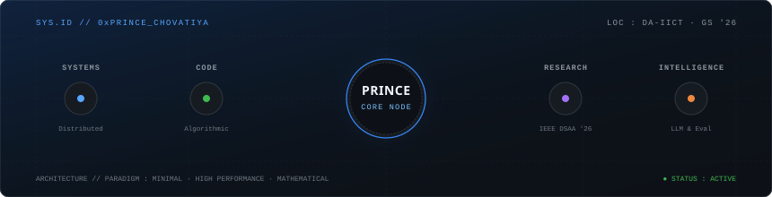
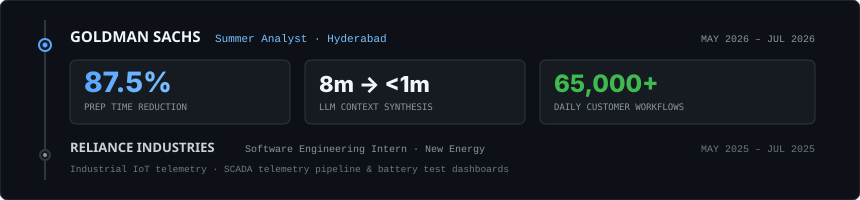
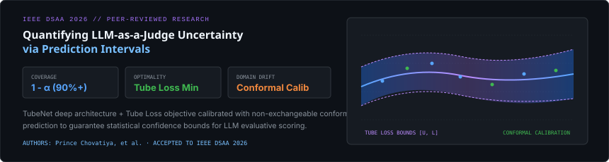
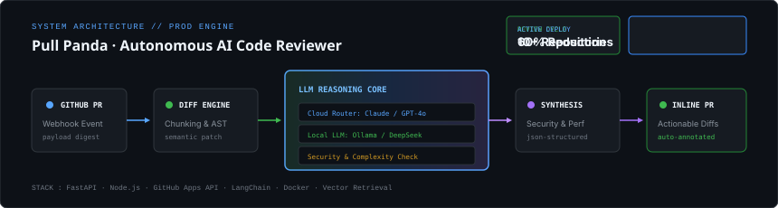
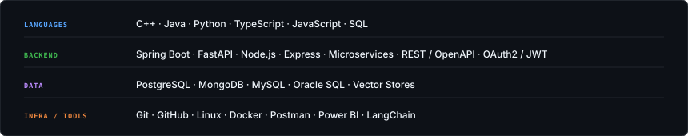
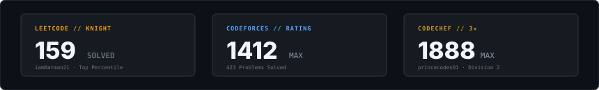

 

  <b>Prince Chovatiya</b> &nbsp;·&nbsp; Information & Communication Technology, Dhirubhai Ambani University ('27)
   
  Incoming Summer Analyst @ Goldman Sachs &nbsp;·&nbsp; IEEE DSAA '26 Researcher &nbsp;·&nbsp; Full-Stack &amp; Distributed Systems

  <a href="mailto:prince.chovatiya01@gmail.com">prince.chovatiya01@gmail.com</a> &nbsp;·&nbsp;
  <a href="https://linkedin.com/in/prince-chovatiya01">LinkedIn</a> &nbsp;·&nbsp;
  <a href="https://github.com/prince-chovatiya01">GitHub</a>

 

---

### `01` &nbsp;// &nbsp;ENGINEERING &amp; INDUSTRY

 

  

 

- **Goldman Sachs** *(Incoming Summer Analyst '26)*: Architected enterprise LLM context synthesis microservices in Spring Boot &amp; FastAPI, reducing analyst preparation latency by 87.5% across 65,000+ daily customer workflows.
- **Reliance Industries** *(Software Engineering Intern '25)*: Built real-time SCADA telemetry pipelines, battery test bench monitoring, and operational dashboards for the New Energy division.

 

---

### `02` &nbsp;// &nbsp;RESEARCH &amp; PUBLICATIONS

 

  

 

> **Quantifying LLM-as-a-Judge Uncertainty via Prediction Intervals: TubeNet, Tube Loss, and Conformal Prediction**  
> *IEEE International Conference on Data Science and Advanced Analytics (DSAA 2026)*  
> Authors: Prince Chovatiya, et al.

Introduces **TubeNet** and a dedicated **Tube Loss** objective calibrated with non-exchangeable conformal prediction to construct mathematically rigorous confidence bounds for LLM evaluative scoring under real-world domain and prompt shift.

 

---

### `03` &nbsp;// &nbsp;FEATURED SYSTEM : PULL PANDA

 

  

 

**[Pull Panda](https://github.com/prince-chovatiya01/pull-panda)** is an autonomous GitHub PR intelligence engine that ingests webhook payloads, extracts semantic AST diffs, and orchestrates multi-tier LLM inference (Claude / GPT-4o / local Ollama) to post actionable, file-precise review annotations directly on pull requests.

 

---

### `04` &nbsp;// &nbsp;CURATED SYSTEMS ARCHIVE

 

#### **01 · [HealthSaathi](https://github.com/prince-chovatiya01/HealthSaathi)**
> **Hospital OPD Orchestration & Offline Token Synchronization Engine**  
> Distributed OPD queue management system designed for low-connectivity environments. Features real-time token dispatching, offline-first local SQLite caching, and automated SMS alerts, reducing patient waiting bottlenecks by 40%.  
> `TypeScript` `React` `Node.js` `Express` `SQLite` `Tailwind CSS`

 

#### **02 · [TurtleTrackr](https://github.com/prince-chovatiya01/turtletrackr)**
> **Quantitative Trading Strategy Backtester & Risk Attribution**  
> High-performance backtesting engine executing the classic Turtle Trading trend-following methodology. Computes real-time ATR volatility position sizing, Sharpe ratios, drawdown profiles, and portfolio performance analytics.  
> `Python` `FastAPI` `Pandas` `NumPy` `Plotly` `Quantitative Finance`

 

#### **03 · [Ghost Water Detector](https://github.com/prince-chovatiya01/ghost-water-detector)**
> **Acoustic Telemetry & Non-Revenue Industrial Water Leak Detection**  
> IoT signal processing pipeline analyzing pipeline vibration and acoustic sensor streams to detect unmetered consumption and sub-surface leaks before structural failures occur.  
> `Python` `Signal Processing` `IoT Telemetry` `FastAPI` `PostgreSQL`

 

#### **04 · [ReckonSLAM](https://github.com/prince-chovatiya01/ReckonSLAM)**
> **Visual Dead Reckoning & SLAM for Mobile Robotics / Android**  
> Camera-based feature tracking and optical flow dead reckoning on edge mobile hardware. Generates real-time point-cloud environment maps for GPS-denied navigation.  
> `C++` `OpenCV` `Java` `Android NDK` `Visual Odometry`

 

#### **05 · [DealFlow 360](https://github.com/tirthgandhi9905/DealFlow360)**
> **Enterprise Deal Pipeline CRM & Automated CPQ System**  
> Full-cycle B2B sales automation platform handling dynamic quote calculations, upsell recommendations, and multi-stage deal tracking across distributed sales teams.  
> `TypeScript` `React` `Node.js` `PostgreSQL` `REST APIs`

 

---

### `05` &nbsp;// &nbsp;TECHNICAL SPECIFICATION

 

  

 

---

### `06` &nbsp;// &nbsp;COMPETITIVE PROGRAMMING

 

  

  <a href="https://leetcode.com/u/IamBatman21/"><b>LeetCode Profile</b> (Knight)</a> &nbsp;·&nbsp;
  <a href="https://codeforces.com/profile/prince.chovatiya01"><b>Codeforces Profile</b> (Max 1412)</a> &nbsp;·&nbsp;
  <a href="https://www.codechef.com/users/princecodes01"><b>CodeChef Profile</b> (Max 1888 · 3★)</a>

 

---

### `07` &nbsp;// &nbsp;SELECTED RECOGNITION

 

- **Deloitte Hacksplosion '26** &nbsp;—&nbsp; **Top 500** / 21,600+ teams nationwide
- **Amazon Hack-On '25** &nbsp;—&nbsp; **Top 12.6%** / 1,860 teams across India
- **Google Big Code Challenge** &nbsp;—&nbsp; **Top 15%** / 100,000+ global participants
- **Lakshya 2.0 National Hackathon** &nbsp;—&nbsp; **Top 100** / 2,500+ teams
- **Apna College Spotlight** &nbsp;—&nbsp; Featured on YouTube with **[90,000+ views](https://www.youtube.com/watch?v=0xlAbN_kCys)**

 

---

  Built with intentional design &amp; mathematical precision · © 2026 Prince Chovatiya

